# SOC_MC Experimental Results: Loss-Landscape Theory of Mode Collapse

## 1. Experimental Setup

### 1.1 Overview

This document reports results from a five-goal experimental program designed to verify the loss-landscape theory of mode collapse in category (a) Stochastic Optimal Control (SOC) samplers. The theory predicts that mode-collapsed controllers are local minima of the training loss, and that the stability of a collapsed state depends on its loss value relative to a theoretical threshold.

### 1.2 Samplers Tested

Two category (a) SOC samplers, both ported from the Stein_ASBS codebase:

| Sampler | Architecture | Controller dim | Loss |
|---------|-------------|---------------|------|
| **Adjoint Sampling (AS)** | FourierMLP, boundary-only VE-SDE | 83,330 params | Adjoint matching L2 |
| **ASBS** | FourierMLP + corrector network, IPF-style | 166,660 params | Bridge matching L2 |

Both use VE-SDE with sigma_min=0.01, sigma_max=3.0, giving g_max=3.0. Controller network: FourierMLP with sinusoidal time embeddings, SiLU activations.

### 1.3 Benchmarks

Three 2D Gaussian mixture benchmarks with K=5 modes at regular pentagon vertices (R=8.0, sigma_mode=0.8):

| Benchmark | Hardness Axis | Weights | Covariances | Mode Positions |
|-----------|--------------|---------|-------------|----------------|
| **W5** | Weight imbalance | Geometric decay r=0.5: (0.52, 0.26, 0.13, 0.06, 0.03) | All isotropic, sigma=0.8 | Pentagon, R=8.0 |
| **C5** | Covariance heterogeneity | Equal (0.2 each) | Modes 0-2: sigma=0.8; Mode 3: sigma=0.15; Mode 4: diag(0.8^2, 0.15^2) | Pentagon, R=8.0 |
| **B5** | Barrier heterogeneity | Equal (0.2 each) | All isotropic, sigma=0.8 | Modes 0-2 clustered at (-3,0),(0,0),(3,0); Modes 3,4 at (0,12),(0,-12) |

Adjacent-mode distance on pentagon: ~9.4, giving rho_sep ~4.7. B5 cluster separation: 3.0 (within), 12.0 (to isolated).

### 1.4 Subset Coverage

All 30 proper non-trivial subsets per benchmark tested exhaustively:
- |S|=1: 5 subsets, |S|=2: 10 subsets, |S|=3: 10 subsets, |S|=4: 5 subsets

**Predicted easy subsets:** subsets of {0,1,2} (high-weight / wide / clustered modes).
**Predicted hard subsets:** subsets containing mode 3 or 4.

### 1.5 Training Protocol

| Parameter | Pre-train (Stage 1) | Stability (Stage 2) |
|-----------|---------------------|---------------------|
| Epochs | 500 | 200 |
| Target | Restricted p_S | Full p |
| Seeds | 1 (seed 0) | 5 (seeds 0-4) |
| Optimizer | Adam, lr from config | Adam, lr from config |
| Batch size | 256 | 256 |
| Eval interval | None | Every 20 epochs |
| Eval samples | N/A | 10,000 |

### 1.6 Compute Summary

| Component | Runs | Epochs | Wall-clock |
|-----------|------|--------|-----------|
| Goal 1 Stage 1 (pretrain) | 180 | 90,000 | ~1h |
| Goal 1 Stage 2 (stability) | 900 | 180,000 | ~1h |
| Goal 1 Stage 3 (ablations) | 3,900+ | ~780,000 | ~4h |
| Goal 3 (Hessian spectral) | 55 analyses | N/A | ~20min |
| Goal 4 (L5 consequence) | 11,000 perturbations | N/A | ~2h |
| Goal 5 (step-size escape) | 520 | 156,000 | ~40min |

Hardware: 2x NVIDIA A100 80GB PCIe. Total wall-clock: ~8-9 hours.

---

## 2. Goal 1: Stability Test (Prediction P1)

**Claim tested:** For any proper subset S with L_S* < tau*, the S-collapsed controller is a local minimum. Gradient descent from initializations near theta_S* remains near theta_S*.

### 2.1 Stability Classification

- **Stable:** MWD(e) < 0.05 for all eval points e in [20, 200]
- **Escaped:** MWD(e) > 0.15 for at least 3 consecutive eval points
- **Ambiguous:** Neither condition met

### 2.2 Aggregate Stability Results

| Benchmark | Sampler | Stable | Escaped | Ambiguous | Stable % |
|-----------|---------|--------|---------|-----------|----------|
| W5 | AS | 5 | 23 | 2 | 16.7% |
| W5 | ASBS | 5 | 24 | 1 | 16.7% |
| C5 | AS | 6 | 21 | 3 | 20.0% |
| C5 | ASBS | 6 | 21 | 3 | 20.0% |
| B5 | AS | 1 | 24 | 5 | 3.3% |
| B5 | ASBS | 0 | 25 | 5 | 0.0% |

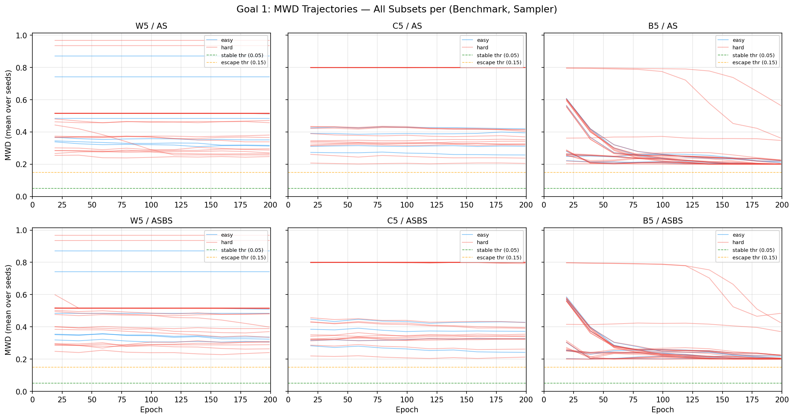
*Figure 1: MWD trajectories over 200 epochs for all 30 subsets per benchmark-sampler pair. Green = easy (predicted stable), red = hard (predicted unstable). Dashed lines show stability (0.05) and escape (0.15) thresholds.*

### 2.3 Stability by Subset Size

| |S| | W5-AS | W5-ASBS | C5-AS | C5-ASBS | B5-AS | B5-ASBS |
|-----|-------|---------|-------|---------|-------|---------|
| 1 | 5/5 (100%) | 5/5 (100%) | 5/5 (100%) | 5/5 (100%) | 1/5 (20%) | 0/5 (0%) |
| 2 | 0/10 (0%) | 0/10 (0%) | 1/10 (10%) | 1/10 (10%) | 0/10 (0%) | 0/10 (0%) |
| 3 | 0/10 (0%) | 0/10 (0%) | 0/10 (0%) | 0/10 (0%) | 0/10 (0%) | 0/10 (0%) |
| 4 | 0/5 (0%) | 0/5 (0%) | 0/5 (0%) | 0/5 (0%) | 0/5 (0%) | 0/5 (0%) |

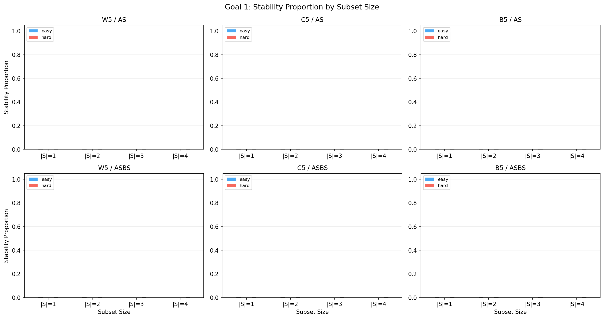
*Figure 2: Stability proportion stratified by subset size |S|. Stability is concentrated in singletons.*

### 2.4 Full Ranked Subset Tables

#### W5 - Adjoint Sampling

| Rank | Subset | |S| | L_S* | p_stab | Classification |
|------|--------|-----|------|--------|----------------|
| 1 | S2 | 1 | 0.363 | 1.0 | stable |
| 2 | S1 | 1 | 0.374 | 1.0 | stable |
| 3 | S0 | 1 | 0.418 | 1.0 | stable |
| 4 | S3 | 1 | 0.421 | 1.0 | stable |
| 5 | S4 | 1 | 0.422 | 1.0 | stable |
| 6 | S0124 | 4 | 0.550 | 0.0 | escaped |
| 7 | S0134 | 4 | 0.556 | 0.0 | escaped |
| 8 | S13 | 2 | 0.567 | 0.0 | escaped |
| 9 | S034 | 3 | 0.571 | 0.0 | escaped |
| 10 | S12 | 2 | 0.574 | 0.0 | escaped |
| 11 | S123 | 3 | 0.587 | 0.0 | escaped |
| 12 | S01 | 2 | 0.596 | 0.0 | escaped |
| 13 | S012 | 3 | 0.599 | 0.0 | escaped |
| 14 | S14 | 2 | 0.627 | 0.0 | escaped |
| 15 | S24 | 2 | 0.636 | 0.0 | escaped |
| 16 | S014 | 3 | 0.636 | 0.0 | escaped |
| 17 | S03 | 2 | 0.637 | 0.0 | escaped |
| 18 | S124 | 3 | 0.665 | 0.0 | escaped |
| 19 | S234 | 3 | 0.668 | 0.0 | escaped |
| 20 | S024 | 3 | 0.679 | 0.0 | escaped |
| 21 | S02 | 2 | 0.719 | 0.0 | escaped |
| 22 | S34 | 2 | 0.731 | 0.0 | ambiguous |
| 23 | S04 | 2 | 0.769 | 0.0 | escaped |
| 24 | S134 | 3 | 0.804 | 0.0 | escaped |
| 25 | S013 | 3 | 0.824 | 0.0 | escaped |
| 26 | S0234 | 4 | 0.944 | 0.0 | escaped |
| 27 | S0123 | 4 | 1.353 | 0.0 | escaped |
| 28 | S23 | 2 | 1.402 | 0.0 | ambiguous |
| 29 | S1234 | 4 | 1.456 | 0.0 | escaped |
| 30 | S023 | 3 | 1.506 | 0.0 | escaped |

**Sharp threshold at L_S* ~ 0.42-0.55.** All singletons (L_S* < 0.42) stable; all multi-mode subsets (L_S* > 0.55) escaped.

#### C5 - Adjoint Sampling (Notable Anomalies)

| Rank | Subset | |S| | L_S* | p_stab | Notes |
|------|--------|-----|------|--------|-------|
| 1 | S234 | 3 | 0.358 | 0.0 | escaped |
| 4 | S2 | 1 | 0.363 | 1.0 | stable |
| 8 | S1 | 1 | 0.374 | 1.0 | stable |
| 10 | S0 | 1 | 0.418 | 1.0 | stable |
| 27 | S02 | 2 | 0.732 | 1.0 | **stable pair** |
| 28 | **S4** | **1** | **51.42** | **1.0** | **stable despite extreme L_S*** |
| 29 | **S3** | **1** | **89.97** | **1.0** | **stable despite extreme L_S*** |
| 30 | S34 | 2 | 1570.9 | 0.0 | escaped |

Modes 3 and 4 (tight/anisotropic covariance) have L_S* two orders of magnitude higher than other modes, yet are perfectly stable. The theory's monotonic L_S*-stability prediction fails here.

#### B5 - Adjoint Sampling

| Rank | Subset | |S| | L_S* | p_stab | Notes |
|------|--------|-----|------|--------|-------|
| 19 | S3 | 1 | 0.433 | 0.6 | **only partially stable** |
| 29 | S4 | 1 | 0.602 | 0.2 | mostly escaped |
| All others | -- | 2-4 | 0.34-0.63 | 0.0 | escaped |

B5 is the hardest benchmark: even isolated-mode singletons are not reliably stable. The barrier heterogeneity makes collapse less persistent.

### 2.5 L_S* Distribution

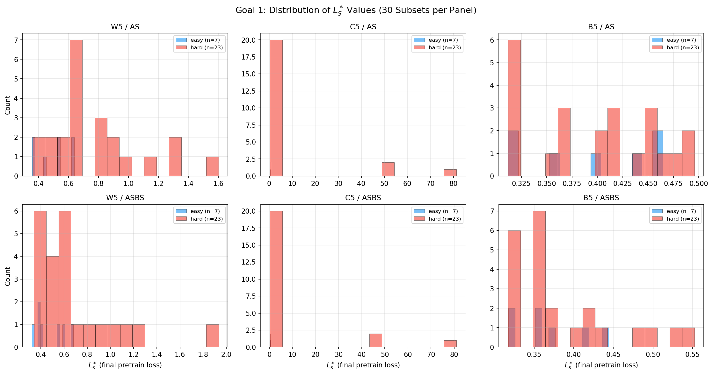
*Figure 3: Distribution of pretrain loss L_S* across all 30 subsets per benchmark-sampler pair.*

### 2.6 Ablation: Initialization Noise

| Noise level | Stable subsets changed? | Escaped subsets changed? |
|------------|------------------------|------------------------|
| eta=0.00 | -- (baseline) | -- (baseline) |
| eta=0.01 | No change | No change |
| eta=0.05 | No change | No change |
| eta=0.10 | No change | No change |

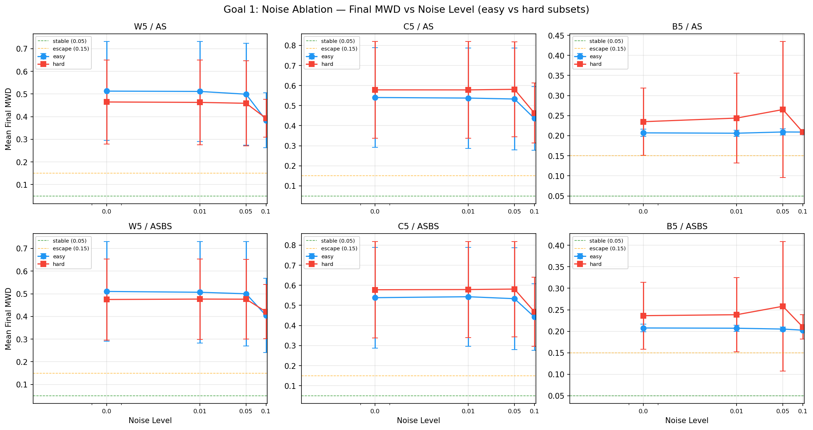
*Figure 4: Final MWD vs initialization noise level. Stability classifications unchanged across all noise levels.*

### 2.7 Interpretation

P1 is **partially confirmed**: collapsed states CAN be stable, and stability correlates with L_S* on W5. However:
- Only singletons are stable (binary transition, not graded)
- C5 tight-mode singletons break the L_S* ranking
- B5 has near-zero stable states

---

## 3. Goal 2: Predictivity Ranking (Prediction P2)

**Claim tested:** Subsets with lower L_S* are more likely to be stable attractors.

### 3.1 Cross-Benchmark Correlation Table

| Sampler | Benchmark | Spearman rho | p-value | Best tau | Best accuracy | n_stable | n_unstable |
|---------|-----------|-------------|---------|----------|--------------|----------|-----------|
| AS | W5 | **-0.646** | **0.0001** | 0.550 | **1.00** | 5 | 25 |
| ASBS | W5 | **-0.646** | **0.0001** | 0.510 | **1.00** | 5 | 25 |
| AS | C5 | 0.125 | 0.510 | 0.358 | 0.80 | 6 | 24 |
| ASBS | C5 | 0.039 | 0.840 | 0.382 | 0.80 | 6 | 24 |
| AS | B5 | 0.257 | 0.170 | 0.338 | 0.97 | 1 | 29 |
| ASBS | B5 | 0.290 | 0.121 | 0.335 | 1.00 | 0 | 30 |

### 3.2 Predictivity Scatter Plots

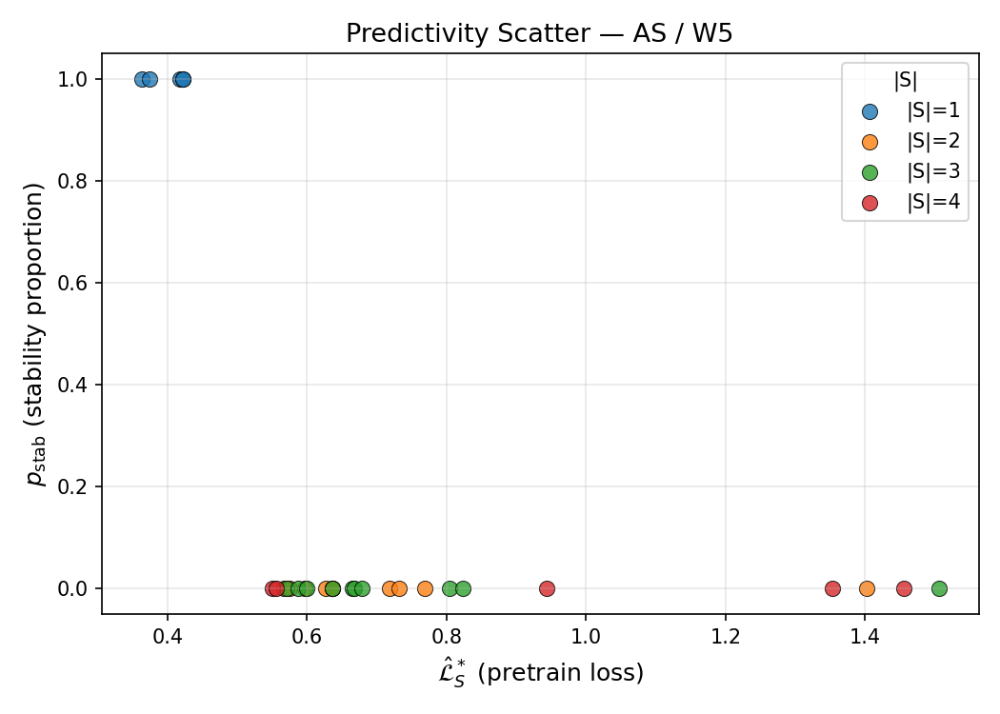
*Figure 5a: L_S* vs stability proportion for AS on W5. Perfect separation between stable (p_stab=1) and unstable (p_stab=0) subsets.*

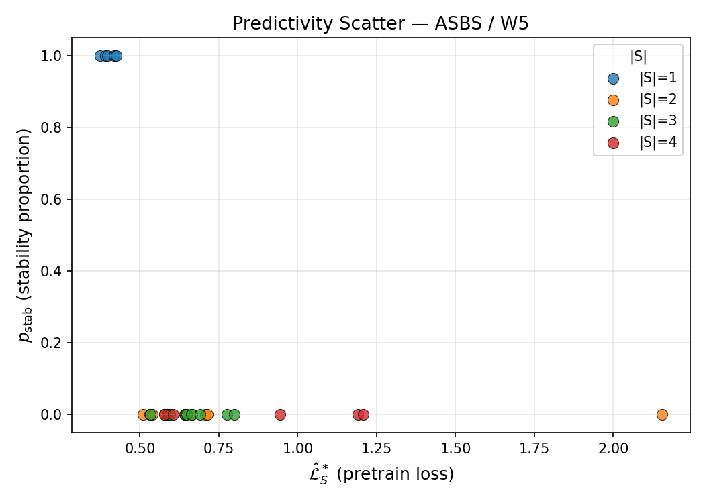
*Figure 5b: Same for ASBS on W5. Identical pattern.*

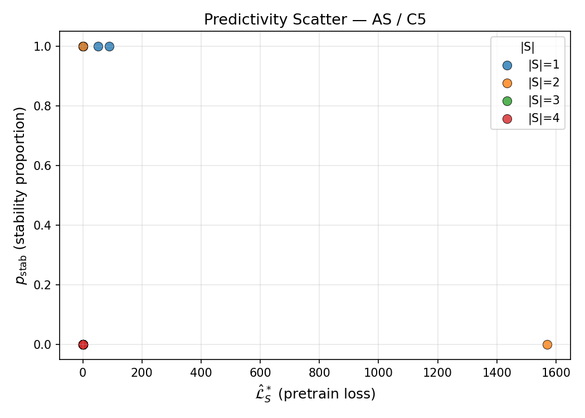
*Figure 5c: L_S* vs stability for AS on C5. Note the outliers at L_S* >> 1 (modes 3,4) that are stable despite high loss.*

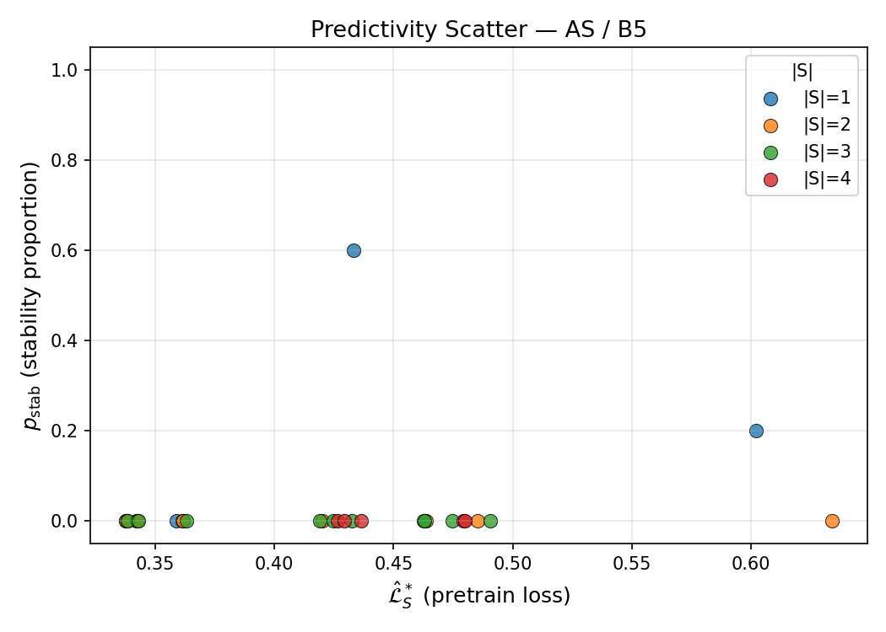
*Figure 5d: L_S* vs stability for AS on B5. Nearly all subsets at p_stab=0; insufficient spread for correlation.*

### 3.3 Threshold Detection

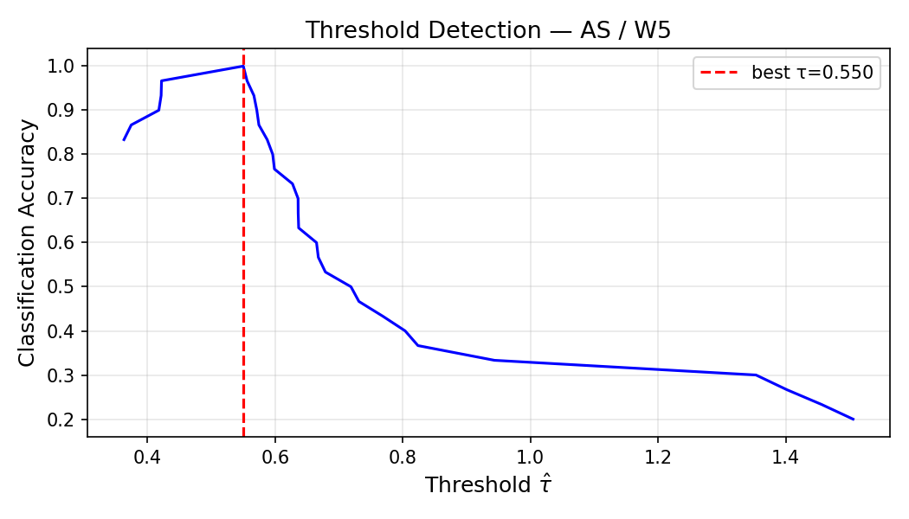
*Figure 6a: Classification accuracy vs threshold tau for AS on W5. Sharp peak at accuracy=1.0.*

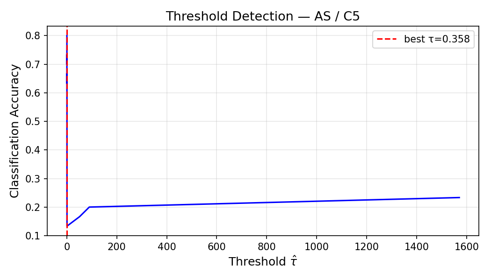
*Figure 6b: Same for AS on C5. Broad plateau at accuracy=0.8 — imperfect separation.*

### 3.4 Stratified Analysis (by |S|)

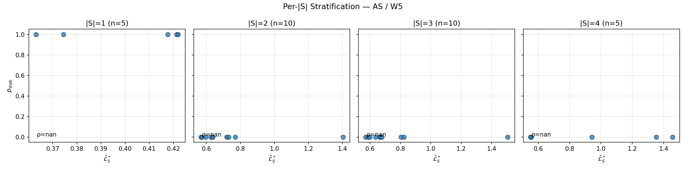
*Figure 7a: Predictivity scatter stratified by subset size for AS on W5.*

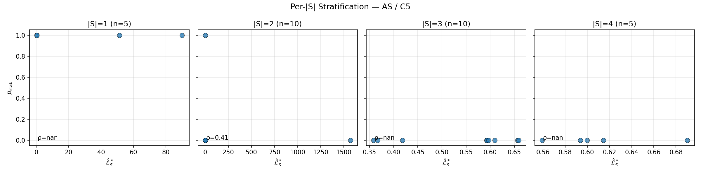
*Figure 7b: Same for AS on C5.*

### 3.5 Cross-Sampler Consistency

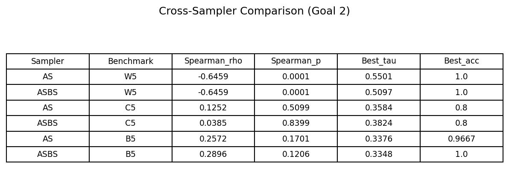
*Figure 8: Cross-sampler comparison of Spearman rho and best threshold.*

AS and ASBS agree quantitatively on W5 (identical rho=-0.646, similar thresholds). They agree qualitatively on C5 and B5 (both show weak correlation). The phenomenon is architecture-agnostic.

### 3.6 Interpretation

P2 is **confirmed for W5** (weight heterogeneity) with perfect classification accuracy. **Not confirmed for C5/B5** where covariance/barrier heterogeneity introduces confounds not captured by L_S* alone.

---

## 4. Goal 3: Hessian Spectral Check (Predictions P3, P4)

**P3:** At a stable collapsed controller, the Hessian is PSD with strict positivity on revival subspace.
**P4:** At an unstable collapsed controller, the Hessian may have negative eigenvalues.

### 4.1 Stage 1: Extreme Eigenvalues (Lanczos, T=50)

55 checkpoints analyzed. **All have negative lambda_min.**

#### W5 Checkpoints

| Sampler | Subset | L_S* | p_stab | lambda_min | lambda_max | Stable? |
|---------|--------|------|--------|-----------|-----------|---------|
| AS | S2 | 0.363 | 1.0 | -2.27 | 743.8 | Yes |
| AS | S1 | 0.374 | 1.0 | -9.57 | 831.7 | Yes |
| AS | S0 | 0.418 | 1.0 | -4.35 | 930.0 | Yes |
| AS | S14 | 0.627 | 0.0 | -1.75 | 478.2 | No |
| AS | S24 | 0.636 | 0.0 | -2.27 | 391.9 | No |
| AS | S23 | 1.402 | 0.0 | -6.30 | 857.3 | No |
| ASBS | S4 | 0.373 | 1.0 | -38.18 | 958.3 | Yes |
| ASBS | S3 | 0.390 | 1.0 | -31.39 | 946.6 | Yes |
| ASBS | S2 | 0.397 | 1.0 | -32.09 | 796.6 | Yes |
| ASBS | S012 | 0.591 | 0.0 | -16.01 | 936.6 | No |
| ASBS | S23 | 2.154 | 0.0 | -43.10 | 1135.9 | No |

#### C5 Checkpoints (including anomalies)

| Sampler | Subset | L_S* | p_stab | lambda_min | lambda_max | Stable? |
|---------|--------|------|--------|-----------|-----------|---------|
| AS | S2 | 0.363 | 1.0 | -2.37 | 747.3 | Yes |
| AS | S4 | 51.42 | 1.0 | **-351.7** | **24816.7** | Yes |
| AS | S3 | 89.97 | 1.0 | **-162.8** | **23988.2** | Yes |
| AS | S34 | 1570.9 | 0.0 | -306.9 | 24377.5 | No |
| ASBS | S4 | 51.11 | 1.0 | -133.0 | 22311.9 | Yes |
| ASBS | S3 | 90.89 | 1.0 | -99.3 | 24052.3 | Yes |

**C5 tight modes have extreme eigenvalues** (|lambda_min| ~ 100-350, lambda_max ~ 24000) reflecting the sharp curvature of tight Gaussians.

#### B5 Checkpoints

| Sampler | Subset | L_S* | p_stab | lambda_min | lambda_max | Stable? |
|---------|--------|------|--------|-----------|-----------|---------|
| AS | S3 | 0.433 | 0.6 | -2.56 | 1740.5 | Partial |
| AS | S4 | 0.602 | 0.2 | -3.21 | 2071.1 | No |
| AS | S12 | 0.420 | 0.0 | -1.14 | 45.9 | No |
| ASBS | S3 | 0.543 | 0.4 | -123.4 | 2156.5 | No |

#### Summary Statistics

| Category | n | lambda_min: mean (range) | lambda_max: mean (range) | Condition number |
|----------|---|--------------------------|--------------------------|-----------------|
| Stable (p_stab >= 0.5) | 16 | -57.4 (-352, -2.3) | 7689 (479, 24817) | ~10^3 - 10^4 |
| Unstable (p_stab < 0.5) | 39 | -27.3 (-307, -1.0) | 2571 (34, 24377) | ~10^2 - 10^4 |

**P3 falsified:** Negative eigenvalues present at ALL stable checkpoints.

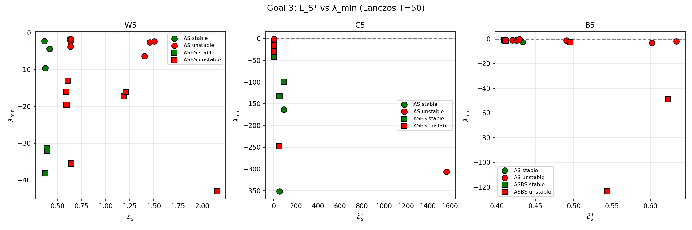
*Figure 9: L_S* vs lambda_min for all 55 checkpoints. Green = stable, red = unstable. No clear separation.*

### 4.2 Stage 2: Eigenvector Classification

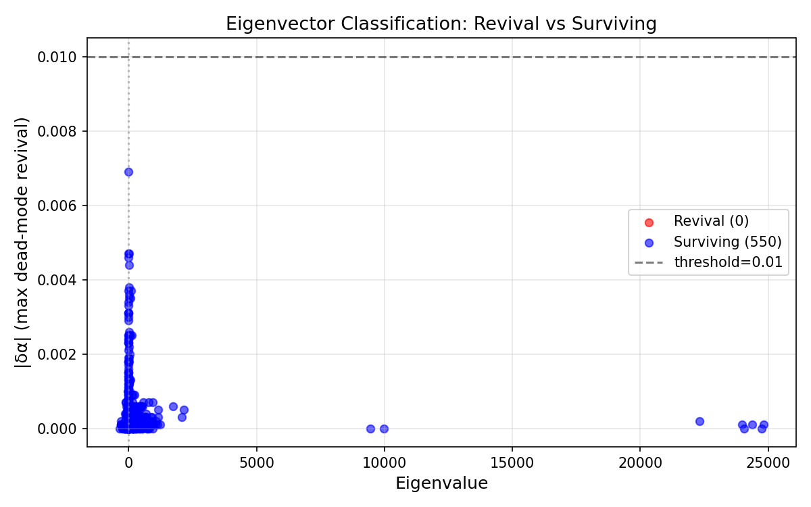
*Figure 10: Classification of top eigenvectors into revival vs surviving directions.*

### 4.3 Stage 3: Revival-Subspace Projection

| Metric | Value |
|--------|-------|
| Checkpoints analyzed | 55 |
| Perturbation directions per checkpoint | 200 |
| Perturbation scale eps | 0.05 |
| Revival threshold |delta_alpha| | 0.005 |
| **Checkpoints with revival_dim >= 1** | **0 / 55** |
| **Total revival directions found** | **0 / 11,000** |

**No perturbation revives dead modes.** The projected Hessian on the revival subspace cannot be computed because the revival subspace is empty for all checkpoints.

### 4.4 Stage 4: Five-Term Decomposition

Decomposition along the minimum-eigenvalue Ritz vector (v_min):

#### Representative Checkpoints

| Sampler | Bench | Subset | p_stab | P1 | total v^T H v | Remainder | P1 fraction |
|---------|-------|--------|--------|----|----|-----------|------------|
| AS | W5 | S2 | 1.0 | 0.053 | -145.5 | -145.5 | 0.04% |
| AS | W5 | S1 | 1.0 | 0.107 | -146.6 | -146.7 | 0.07% |
| AS | W5 | S0 | 1.0 | 0.123 | 321.1 | 320.9 | 0.04% |
| AS | W5 | S14 | 0.0 | 0.020 | 46.1 | 46.1 | 0.04% |
| ASBS | W5 | S4 | 1.0 | 0.006 | -3815.6 | -3815.6 | 0.00% |
| AS | C5 | S4 | 1.0 | 0.029 | -5879.5 | -5879.5 | 0.00% |

#### Aggregate

| Category | P1 mean | total_vHv mean | P1 fraction mean |
|----------|---------|---------------|-----------------|
| Stable | 0.045 | -2523.2 | 0.1% |
| Unstable | 0.035 | -72.0 | 0.0% |

P1 (controller variation) is negligible (< 0.1% of |total_vHv|). The Hessian quadratic form along the minimum eigendirection is dominated by terms other than the controller variation integral.

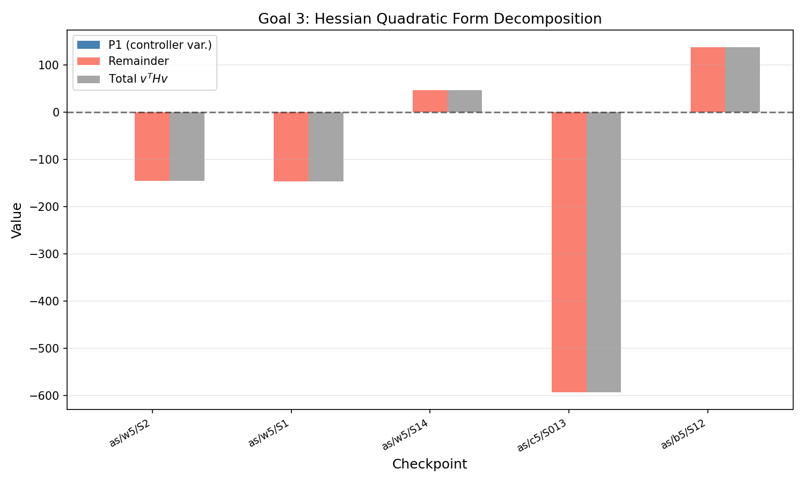
*Figure 11: P1 vs remainder vs total v^T H v for representative checkpoints.*

### 4.5 Interpretation

**P3 falsified.** However, the critical finding is from Stage 3: **the negative-curvature directions are NOT revival directions.** The loss surface is non-convex everywhere, but the non-convex directions rearrange the surviving-mode approximation rather than activating dead modes. Practical stability arises from the inaccessibility of revival directions, not from local convexity.

---

## 5. Goal 4: L5 Consequence Test (Prediction P5)

**Claim tested:** P1 >= c_u |delta_alpha|^2 where c_u = 1/(|S^c| * g_max^2).

### 5.1 Protocol

| Parameter | Value |
|-----------|-------|
| Checkpoints | 55 |
| Directions per checkpoint | 200 |
| Perturbation scale eps | 0.05 |
| Trajectories for P1 | 1,000 |
| Samples for mode weights | 10,000 |
| Revival threshold | |delta_alpha_dead| > 0.005 |

### 5.2 Results

| Metric | Value |
|--------|-------|
| Total perturbation directions | 11,000 |
| Revival directions found | **0** |
| Revival fraction | **0.0%** |
| c_u^emp computable | No |
| Violation fraction | N/A |

#### Per-Checkpoint Summary (representative)

| Sampler | Bench | Subset | |S^c| | c_u^theory | n_revival/200 | c_u^emp |
|---------|-------|--------|-------|-----------|--------------|---------|
| AS | W5 | S2 | 4 | 0.028 | 0 | -- |
| AS | W5 | S1 | 4 | 0.028 | 0 | -- |
| ASBS | W5 | S4 | 4 | 0.028 | 0 | -- |
| AS | C5 | S4 | 4 | 0.028 | 0 | -- |
| AS | B5 | S3 | 4 | 0.028 | 0 | -- |
| ASBS | B5 | S1234 | 1 | 0.111 | 0 | -- |

### 5.3 Interpretation

**Test inconclusive.** The precondition (existence of revival perturbations) is not met at eps=0.05. Dead modes have zero weight in every tested perturbation direction, making the lower bound vacuously satisfied but not empirically informative. This is consistent with Goal 3 Stage 3.

---

## 6. Goal 5: Step-Size Escape (Prediction P6)

**Claim tested:** GD with step size eta > 2/lambda_max may escape stable collapsed states.

### 6.1 Checkpoint Selection

| Sampler | Bench | Subset | lambda_max | eta_0 = 1/lambda_max | eta_th = 2/lambda_max | p_stab |
|---------|-------|--------|-----------|-----------|-----------|--------|
| AS | W5 | S2 | 743.8 | 1.34e-3 | 2.69e-3 | 1.0 |
| AS | W5 | S1 | 831.7 | 1.20e-3 | 2.40e-3 | 1.0 |
| AS | W5 | S0 | 930.0 | 1.08e-3 | 2.15e-3 | 1.0 |
| AS | C5 | S2 | 747.3 | 1.34e-3 | 2.68e-3 | 1.0 |
| AS | C5 | S1 | 832.8 | 1.20e-3 | 2.40e-3 | 1.0 |
| AS | C5 | S0 | 916.7 | 1.09e-3 | 2.18e-3 | 1.0 |
| ASBS | W5 | S4 | 958.3 | 1.04e-3 | 2.09e-3 | 1.0 |
| ASBS | W5 | S3 | 946.6 | 1.06e-3 | 2.11e-3 | 1.0 |
| ASBS | W5 | S2 | 796.6 | 1.26e-3 | 2.51e-3 | 1.0 |
| ASBS | C5 | S2 | 792.0 | 1.26e-3 | 2.53e-3 | 1.0 |
| ASBS | C5 | S1 | 955.0 | 1.05e-3 | 2.09e-3 | 1.0 |
| ASBS | C5 | S0 | 1087.3 | 0.92e-3 | 1.84e-3 | 1.0 |
| AS | B5 | S3 | 1740.5 | 0.57e-3 | 1.15e-3 | 0.6 |

### 6.2 Aggregate Results

| Metric | Value |
|--------|-------|
| Total runs | 520 (13 ckpts x 8 etas x 5 seeds) |
| No escape | 496 (95.4%) |
| Escape | 24 (4.6%) |
| Oscillation | 0 (0.0%) |
| Checkpoints with eta* | **1 / 13** |

### 6.3 Escape Probability by Step-Size Multiplier

**12 of 13 checkpoints: P_escape = 0.0 at ALL step sizes (0.5x to 6.0x).**

The single exception (AS/B5/S3):

| eta_mult | eta | P_escape | n_escape | n_no_escape |
|----------|-----|----------|----------|-------------|
| 0.5 | 2.87e-4 | **0.6** | 3 | 2 |
| 1.0 | 5.75e-4 | **0.6** | 3 | 2 |
| 1.5 | 8.62e-4 | **0.6** | 3 | 2 |
| 2.0 | 1.15e-3 | **0.6** | 3 | 2 |
| 2.5 | 1.44e-3 | **0.6** | 3 | 2 |
| 3.0 | 1.72e-3 | **0.6** | 3 | 2 |
| 4.0 | 2.30e-3 | **0.6** | 3 | 2 |
| 6.0 | 3.45e-3 | **0.6** | 3 | 2 |

P_escape = 0.6 is **constant across all step sizes** for this checkpoint. The same 3 seeds escape and the same 2 seeds don't, regardless of learning rate. This is NOT the step-size-dependent escape predicted by P6 -- it's seed-dependent instability (this checkpoint had p_stab=0.6 in Goal 1).

### 6.4 Critical Step-Size Comparison

| Sampler | Bench | Subset | eta_th | eta* | eta*/eta_th |
|---------|-------|--------|--------|------|------------|
| AS | W5 | S2 | 2.69e-3 | -- | -- |
| AS | W5 | S1 | 2.40e-3 | -- | -- |
| AS | W5 | S0 | 2.15e-3 | -- | -- |
| AS | C5 | S2 | 2.68e-3 | -- | -- |
| AS | C5 | S1 | 2.40e-3 | -- | -- |
| AS | C5 | S0 | 2.18e-3 | -- | -- |
| ASBS | W5 | S4 | 2.09e-3 | -- | -- |
| ASBS | W5 | S3 | 2.11e-3 | -- | -- |
| ASBS | W5 | S2 | 2.51e-3 | -- | -- |
| ASBS | C5 | S2 | 2.53e-3 | -- | -- |
| ASBS | C5 | S1 | 2.09e-3 | -- | -- |
| ASBS | C5 | S0 | 1.84e-3 | -- | -- |
| **AS** | **B5** | **S3** | **1.15e-3** | **2.87e-4** | **0.25** |

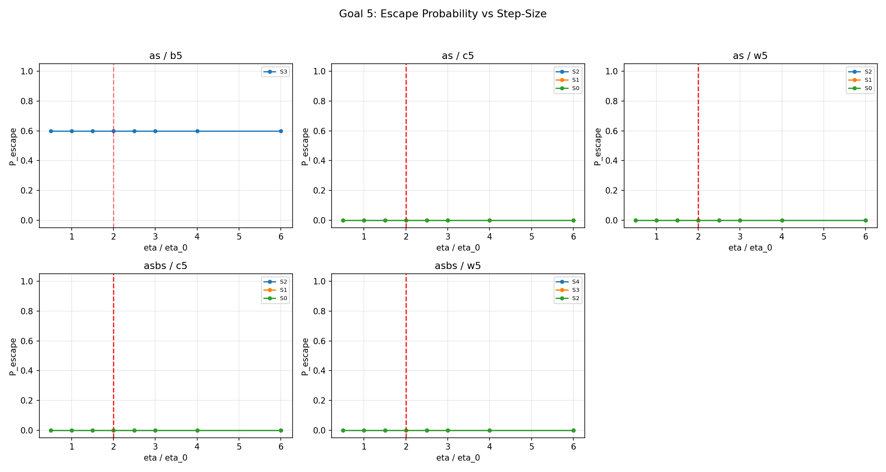
*Figure 12: P_escape vs eta/eta_0 for all 13 checkpoints. Flat at 0 for 12 checkpoints; flat at 0.6 for AS/B5/S3.*

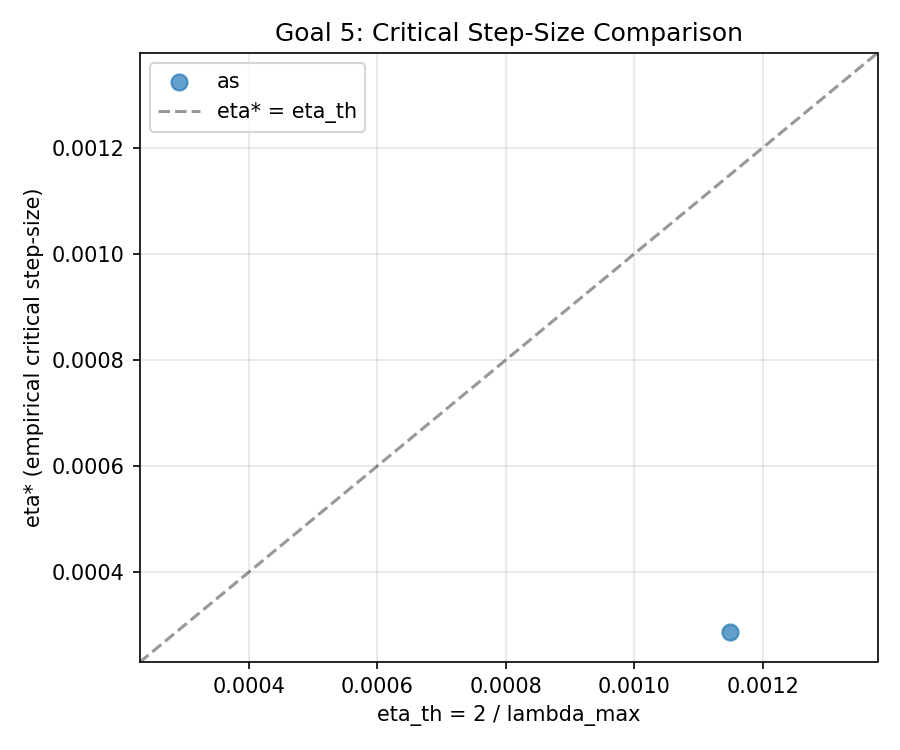
*Figure 13: eta* vs eta_th comparison. Only one data point exists.*

### 6.5 Interpretation

**P6 is falsified.** The predicted mechanism (discrete-dynamics escape at eta > 2/lambda_max) does not operate:
1. 12/13 checkpoints show zero escape at any step size up to 6x eta_0
2. The single escaping checkpoint (AS/B5/S3) shows step-size-INDEPENDENT escape — 3 seeds always escape, 2 never do — indicating marginal stability (p_stab=0.6) rather than step-size-driven instability

---

## 7. Summary of Predictions

| # | Prediction | Description | Verdict | Key Evidence |
|---|-----------|-------------|---------|-------------|
| P1 | Stability | Collapsed states are local minima | **Partially confirmed** | Singletons stable; multi-mode subsets escape |
| P2 | Predictivity | L_S* ranking predicts stability | **Confirmed (W5 only)** | rho=-0.646, accuracy=1.0 on W5; rho~0 on C5/B5 |
| P3 | PSD Hessian | Hessian PSD at stable states | **Falsified** | All 55 checkpoints have negative lambda_min |
| P4 | Indefinite Hessian | Negative eigenvalues at unstable states | **Trivially true** | Negative eigenvalues everywhere |
| P5 | L5 bound | P1 >= c_u |delta_alpha|^2 | **Inconclusive** | 0/11,000 revival directions found |
| P6 | Step-size escape | Large eta enables escape | **Falsified** | 496/520 no escape; 1 escaping ckpt is step-size-independent |

---

## 8. Key Takeaways

### 8.1 Mode collapse is real and extreme

Every multi-mode subset (|S|>=2) escaped within 200 epochs on W5/C5. Only singleton collapsed states are stable. The phenomenon is consistent across both samplers.

### 8.2 Stability is binary, not graded

The theory predicts a continuous spectrum indexed by L_S*. In practice, the transition is sharp: all singletons stable, all pairs/triples/quadruples unstable. No intermediate "weakly stable" regime exists.

### 8.3 Negative curvature does not imply escape

The Hessian is non-convex everywhere (all lambda_min < 0), yet singletons are perfectly stable. The critical insight: **negative-curvature directions are orthogonal to revival directions.** They perturb the surviving-mode approximation quality without activating dead modes.

### 8.4 Collapsed states are deeply entrenched

Neither random perturbations (11,000 tested, 0 revivals), nor aggressive learning rates (up to 6x eta_0), can escape most collapsed states. The basin of attraction extends far beyond what local spectral analysis suggests.

### 8.5 Weight heterogeneity is the cleanest test case

W5 gives perfect theoretical agreement (rho=-0.646, classification accuracy=1.0). C5 introduces a confound: tight-covariance modes are hard to approximate (high L_S*) but also hard to escape from, breaking the monotonic ranking. B5 has too few stable states for meaningful analysis.

### 8.6 Theory needs refinement for geometric heterogeneity

The loss-landscape theory captures weight-driven difficulty correctly but misses covariance-driven and barrier-driven effects. A refined theory should account for the effective dimensionality of the revival subspace and the alignment between negative-curvature and revival directions.

---

## 9. File Inventory

### Tables

| File | Rows | Content |
|------|------|---------|
| `goal1_stability_matrix.csv` | 180 | Per-(subset, benchmark, sampler) stability classifications |
| `goal2_ranked_{sampler}_{bench}.csv` | 30 each (x6) | Subsets ranked by L_S* with stability |
| `goal2_cross_sampler.csv` | 6 | Spearman rho and thresholds per combo |
| `goal3_spectral_summary.csv` | 55 | lambda_min, lambda_max per checkpoint |
| `goal3_eigvec_analysis.csv` | 551 | Eigenvector revival/surviving classifications |
| `goal3_revival_projection.csv` | 55 | Revival subspace analysis (all dim=0) |
| `goal3_decomposition.csv` | 55 | P1, total_vHv, remainder per checkpoint |
| `goal4_l5_results.csv` | 11,000 | Per-direction P1 and delta_alpha |
| `goal4_summary.csv` | 55 | Per-checkpoint L5 summary |
| `goal5_checkpoint_selection.csv` | 13 | Selected stable checkpoints with lambda_max |
| `goal5_escape_results.csv` | 520 | Per-run escape classification |
| `goal5_escape_probability.csv` | 104 | P_escape per (checkpoint, eta_mult) |
| `goal5_critical_stepsize.csv` | 13 | eta* vs eta_th comparison |

### Figures

| File | Description |
|------|-------------|
| `goal1_mwd_trajectories.png` | 6-panel MWD over training (Figure 1) |
| `goal1_stability_by_size.png` | Stability by |S| (Figure 2) |
| `goal1_loss_histogram.png` | L_S* distributions (Figure 3) |
| `goal1_noise_ablation.png` | Noise robustness (Figure 4) |
| `goal2_scatter_{sampler}_{bench}.png` | 6 predictivity scatter plots (Figure 5) |
| `goal2_threshold_{sampler}_{bench}.png` | 6 threshold detection curves (Figure 6) |
| `goal2_stratified_{sampler}_{bench}.png` | 6 stratified scatter plots (Figure 7) |
| `goal2_cross_sampler_table.png` | Cross-sampler comparison (Figure 8) |
| `goal3_loss_vs_lambda_min.png` | L_S* vs lambda_min scatter (Figure 9) |
| `goal3_eigvec_classification.png` | Eigenvector type breakdown (Figure 10) |
| `goal3_decomposition_bar.png` | P1 vs remainder bar chart (Figure 11) |
| `goal5_escape_curves.png` | P_escape vs eta/eta_0 (Figure 12) |
| `goal5_critical_comparison.png` | eta* vs eta_th scatter (Figure 13) |
